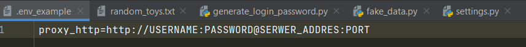
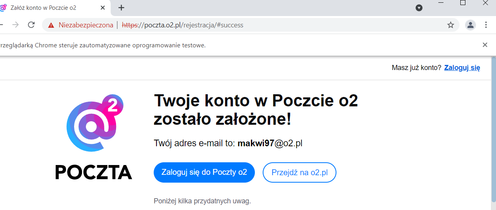
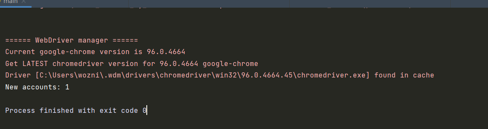
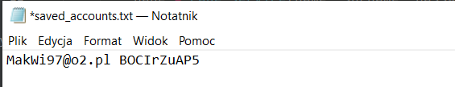
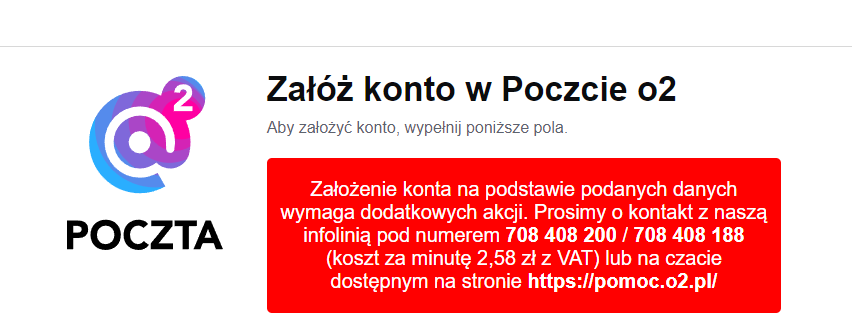
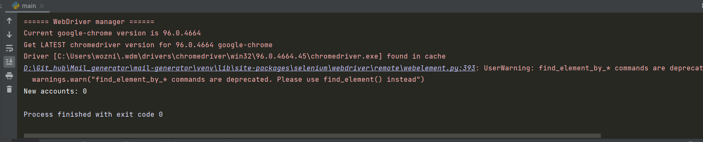
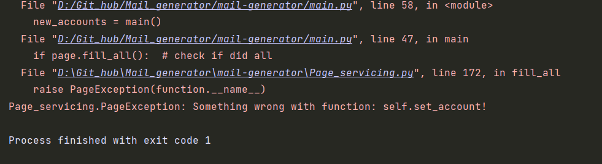

## Mail Generator
<br>
Mail Generator is a script created in python 3.8 based on selenium library, which help with automation setting up new email accounts.It's work with polish domain called O2.pl
Script generate random polish name and surname

## Installation 💾
To install script, open a comand line in a directory where you want to have script installed and use git clone command:

```bash
git clone https://github.com/13Dominik/mail-generator.git
```
Setting up a new project and then use:
```bash
pip install -r requirements.txt
```
It will download all packages which are needed to run script

## Usage 🔧
The main problem with script is a fact that when server have to much request, it blocks by IP adress.It means that you can set up max 2 accounts in a row 
and then you have to wait to be unbanned.

To avoid it you can use a proxy, but there is the same situation, max 2 accounts and then it will be propably banned for some period of time.

Additionally it must be a polish proxy.The best solution would be use a polish rotating proxy.It will propably eliminate a problem.

If you want to use a proxy make a new file named .env and set up proxy like in file .env_example:


Now, script will load proxy from file .env and use it.
If you don't want to use proxy, just miss this step.<br><br>
Now you can run main.py<br>
You will see how program fill all the labels and clicking buttons.When everything is fine you will be redirected to new page like this:<br><br>
 <br>
On the terminal you will see this:<br><br>
 <br>
On your project folder will be created file saved_accounts.txt.Data about all created accounts will be saved to this file.<br><br>
 <br>

When after refreshing page you see this:<br><br>
<br><br>
And on terminal you see this:<br><br>
<br><br>
It means you have been blocked by IP and now you have to wait some period of time to be unblocked or think about proxy.You can also make a hotspot from your's
smartphone but it is only temporary solution cause after 2 accounts you will be banned again.<br><br>
There is also some problems not connected with blocking by IP.Program can be terminated and you will see this on terminal:<br><br>
<br><br>
In this case just rerun program.<br>
It was the most commonly problems. If something different appear, look what was written on terminal cause propably it would be a exception
calling with which function occured a problem.<br><br>
If you have some questions, just write 😊


## Contributors :eyes:
13Dominik - https://github.com/13Dominik<br>
Wozniakos10 - https://github.com/wozniakos10<br>
Twomasz - https://github.com/Twomasz<br>

